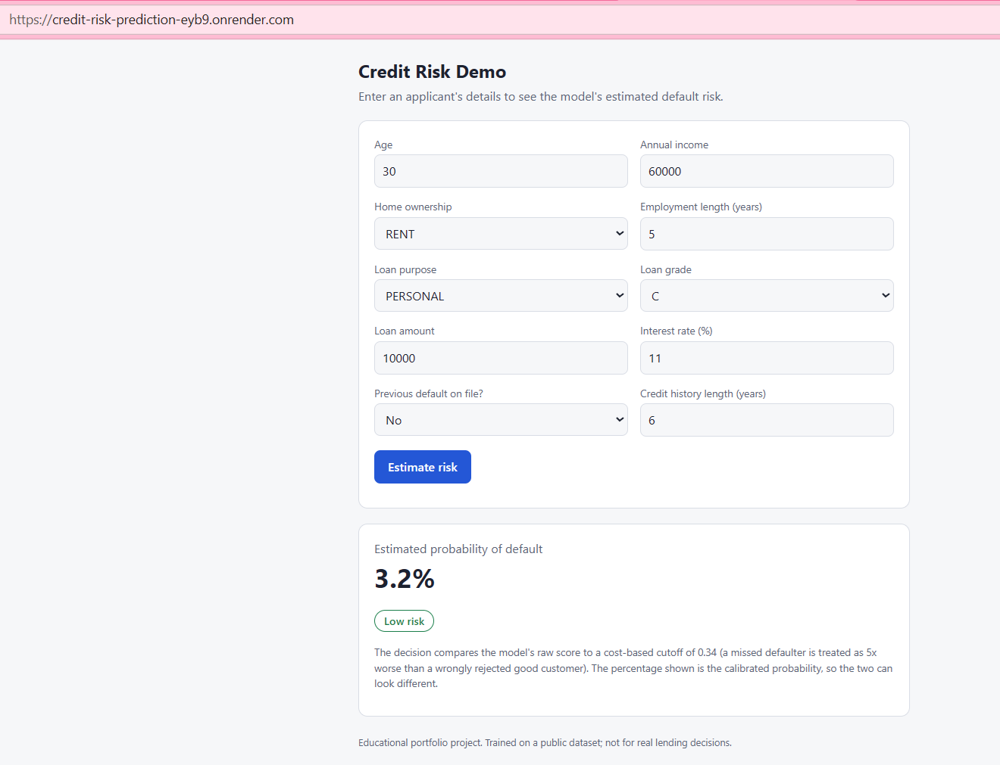
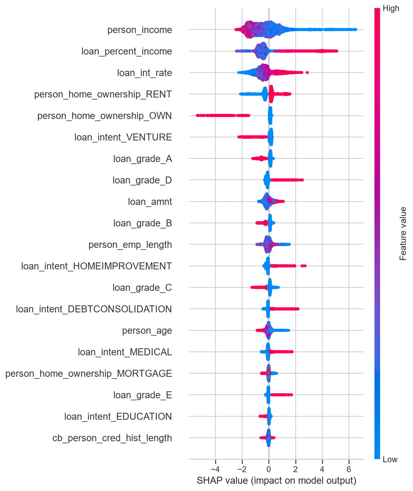
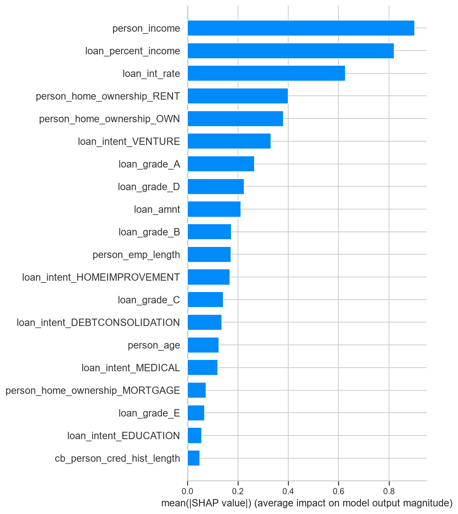

# Credit Risk Prediction

Predicts the probability that a loan applicant defaults, and turns that probability into an approve / review decision using an explicit business-cost threshold.

**Live demo:** https://credit-risk-prediction-eyb9.onrender.com
The demo runs on a free instance that sleeps when idle, so the first request can take 30-60 seconds to wake it.



## Problem

A lender loses most of the loan when it approves someone who defaults, but only the interest margin when it rejects someone who would have repaid. Accuracy is a poor measure here: only 21.8% of applicants default, so a model that approves everyone scores about 78% accuracy while catching no defaulters.

## Results

Held-out test set (about 6,480 applicants), decision threshold 0.34:

| Metric | Value |
|---|---|
| ROC-AUC | 0.954 |
| PR-AUC (no-skill baseline = 0.219) | 0.913 |
| Recall | 0.870 (185 defaulters missed) |
| Precision | 0.665 (620 good customers flagged) |
| Average cost per applicant | 0.238 |
| Brier score, raw -> calibrated | 0.061 -> 0.050 |

Average cost per applicant, assuming a missed defaulter costs 5x a wrongly flagged good customer:

| Strategy | Cost |
|---|---|
| Approve everyone (no model) | 1.094 |
| Model at default threshold 0.5 | 0.244 |
| Model at cost-optimal threshold 0.34 | 0.238 |

Model comparison (5-fold stratified CV on the training data, PR-AUC): Logistic Regression 0.721, Random Forest 0.881, XGBoost 0.901. After tuning, test PR-AUC is 0.913 against a CV score of 0.905, so there is no sign of overfitting to the validation folds.

## Approach

1. **Cleaning:** removed duplicates and impossible values (age over 100, employment length over 60 or over age, non-positive income or loan amount). Rows with *missing* values are kept and imputed later, inside the pipeline.
2. **Leakage-safe pipeline:** a scikit-learn `Pipeline` with `ColumnTransformer` (median imputation with missing-value indicators, one-hot encoding with `handle_unknown="ignore"`). Preprocessing is fitted on training folds only.
3. **Model selection:** compared logistic regression, random forest and XGBoost with stratified 5-fold CV, scored on PR-AUC.
4. **Imbalance:** compared no handling, class weights and SMOTE inside the CV pipeline. The three performed almost identically (PR-AUC 0.903 / 0.901 / 0.902), so class weights were kept.
5. **Tuning:** randomized search (150 iterations) on PR-AUC.
6. **Threshold:** chosen from out-of-fold predictions on the training set by minimising expected cost (false negative 5, false positive 1), so the test set stays untouched.
7. **Calibration:** isotonic calibration, which lowered the Brier score from 0.061 to 0.050.
8. **Explainability:** SHAP for global and per-applicant explanations.

## What drives the model




Income, loan-to-income ratio and interest rate are the strongest signals. Loan grade is one-hot encoded, so its importance is split across several columns; summed, it is larger than any single column suggests.

## Run it

Download `credit_risk_dataset.csv` from Kaggle into `data/raw/` (the data is not stored in this repository).

```bash
pip install -r requirements.txt
python src/train.py --n-iter 5      # quick run; omit the flag for the full 50-iteration search
uvicorn app.main:app --reload       # demo at http://localhost:8000
pytest                              # 9 tests
```

Docker:

```bash
docker build -f deployment/Dockerfile -t credit-risk-api .
docker run -p 8000:8000 credit-risk-api
```

## Project structure

```
app/            FastAPI service (/health, /predict) and the static demo page
src/train.py    End-to-end training script, also used by the tests
tests/          Unit tests for training code and API tests
notebooks/      Full analysis: EDA, model comparison, calibration, SHAP, error analysis
deployment/     Dockerfile and pinned API requirements
artifacts/      Trained models and the threshold/config file
docs/           Images used in this README
```

## Deployment

The service runs in a Docker container on Render. Library versions are pinned exactly, because the saved models are pickled files that are only guaranteed to load in the version that created them. The trained models are committed to the repository so the deployed model is the one that was tested.

## Limitations

- **Two probability scales:** the approve/review decision compares the *raw* model score with the 0.34 threshold, which was tuned on raw scores, while the percentage shown to the user is the *calibrated* probability. The two can disagree, for example a low displayed percentage with a "review" decision. A cleaner design would tune the threshold on calibrated out-of-fold probabilities.
- **Assumed costs:** the 5:1 cost ratio is an illustration. A real lender would derive it from loan size, loss given default and margin.
- **Dataset:** public Kaggle data with no time dimension, so behaviour over time cannot be tested. `loan_grade` and `loan_int_rate` come from the lender's own assessment, so they may not be available at decision time.
- **Fairness:** age and home ownership can act as proxies for protected attributes. A real deployment would need a fairness audit.
- **Missed defaulters:** the false negatives look like safe borrowers on the available features. Existing debt, repayment history and cash-flow data would be needed to catch them.
- **Free hosting:** the demo sleeps when idle.

## Workflow

Git-flow style branches: `main` <- `develop` <- feature branches, each merged through a pull request.

## License

MIT. Dataset: see its Kaggle page for terms.